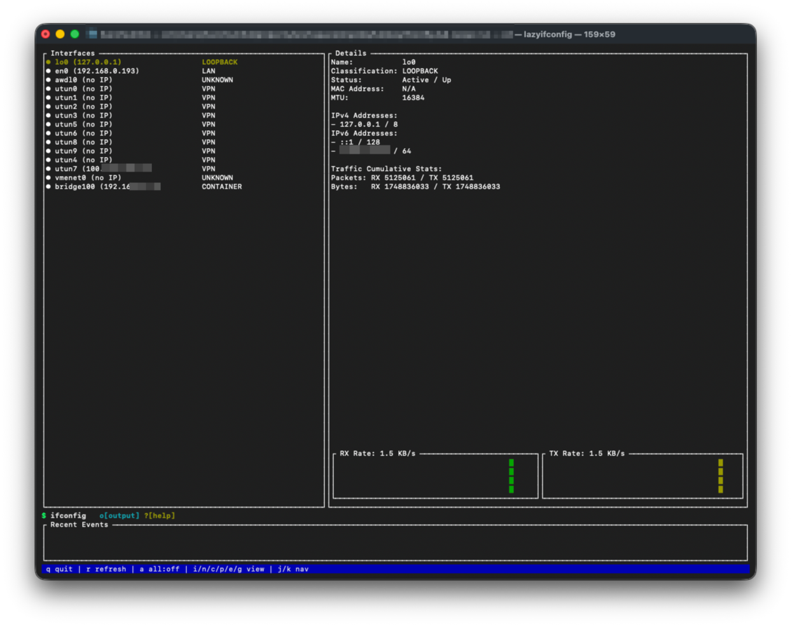
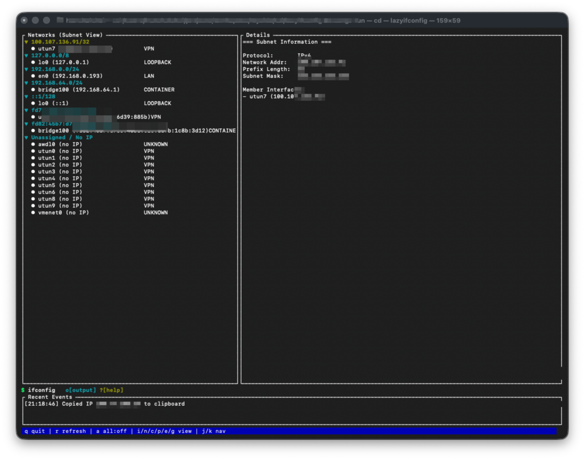
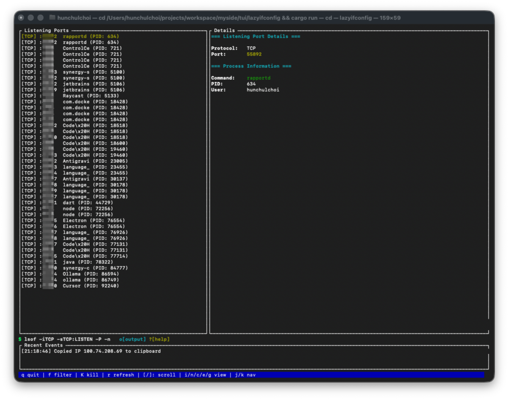
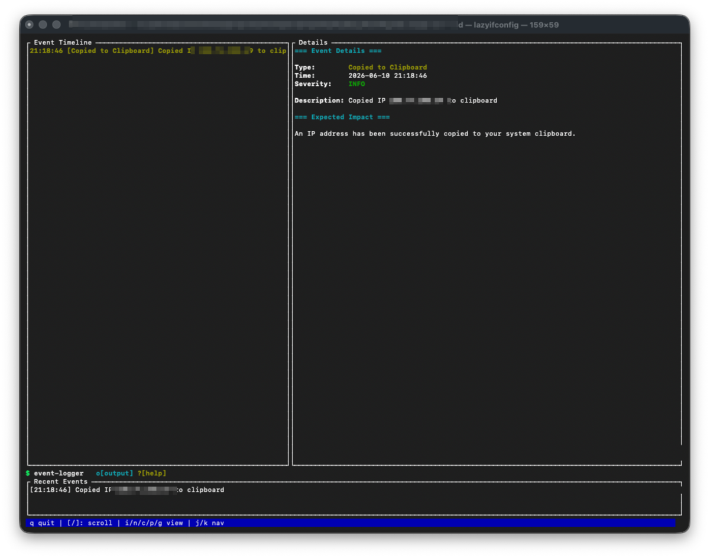

# lazyifconfig

[English README](README.md)

`lazyifconfig`는 로컬 네트워크 상태를 확인하는 터미널 UI입니다.
인터페이스, 서브넷, 라우트, 연결, 포트, 최근 네트워크 이벤트를 한 화면에서 볼 수 있도록 로컬 인터페이스, 라우트, 연결, 포트, 공인 IP 정보를 모아 보여줍니다.

## 스크린샷



<p>
  
  
</p>
<p>
  
</p>

## 기능

- 인터페이스 인벤토리: 플랫폼이 제공하는 경우 인터페이스 이름, 상태, 종류, MAC 주소, MTU, IPv4/IPv6 주소, prefix, gateway, 트래픽 카운터를 보여줍니다.
- 네트워크 화면: LAN, loopback, VPN, container, link-local, public, unassigned 네트워크를 서브넷 단위로 묶어 더 빠르게 훑어볼 수 있게 합니다.
- 연결 화면: `netstat -an`에서 가져온 로컬/원격 endpoint를 정렬, 필터링, 복사 액션, 연결별 상세 정보와 함께 보여줍니다.
- 포트 화면: macOS에서는 `lsof`, Linux에서는 `ss`, Windows에서는 `netstat`으로 listening TCP port를 보여주며, 프로세스 상세 정보와 kill 액션을 제공합니다.
- Route Inspector: default route, route table, route diagnostics, VPN route hint, raw route command output을 요약합니다.
- 목적지 경로 조회: 특정 목적지가 어떤 인터페이스, gateway, source IP로 라우팅되는지 확인하고, 가능한 경우 VPN 여부를 포함한 compact path view를 렌더링합니다.
- 진단: default route 누락, default route 중복, down interface가 사용되는 route, 누락된 interface, route metric conflict를 표시합니다.
- 타임라인: 인터페이스 등장/삭제, 주소 변경, 상태 변경, VPN 관련 변경, 공인 IP 변경, 복사 액션, 업데이트 확인 등 앱 내부 이벤트를 기록합니다.
- Tools Hub: TUI 또는 CLI에서 DNS 조회, Whois/RDAP 조회, IP 정보, TCP 포트 체크, TLS 검사, ping, traceroute를 실행합니다.
- DNS와 IP 정보: DNS record, reverse DNS, 가능한 경우 ASN/조직/국가 정보를 확인하며, Windows에서는 Windows 기본 `nslookup`을 사용합니다.
- TLS Inspector: native Rust TLS library로 연결하여 protocol, cipher suite, 인증서 subject/issuer, 유효 기간, SAN, 인증서 개수를 보고합니다.
- Raw output viewer: 각 화면을 만들 때 사용한 command output을 앱 안에 보관하여 요약 화면과 원본 명령 출력을 비교할 수 있게 합니다.
- Self-update 지원: GitHub Releases를 백그라운드에서 확인하고, 사용 가능한 release artifact가 있으면 설치할 수 있습니다.

## 개인정보

`lazyifconfig`는 telemetry를 수집하지 않고, 사용자를 추적하지 않으며, analytics 목적으로 외부에 요청하지 않습니다.
또한 로컬 인터페이스, 라우트, 포트, 연결, 프로세스 데이터를 프로젝트 소유 서버로 업로드하지 않습니다.
계정 시스템, 백그라운드 analytics SDK, 사용량 보고, 숨겨진 데이터 수집이 없습니다.

대부분의 화면은 로컬 운영체제 명령을 실행하고 그 결과를 메모리에서 파싱해 만들어집니다.
Raw command output은 실행 중인 앱 내부에서만 확인용으로 보관되며, `lazyifconfig`가 어디로도 전송하지 않습니다.
타임라인 export는 사용자가 `S`를 누를 때만 실행되고, 현재 디렉터리의 로컬 파일로 저장됩니다.

일부 기능은 사용자가 활성화하거나 직접 실행할 때 외부 서비스에 요청합니다.

- 공인 IP 조회는 `https://ipinfo.io/json`에 요청합니다.
- release check는 이 repository의 GitHub Releases API에 요청합니다.
- 로컬 Whois가 없을 때 Whois/RDAP fallback은 HTTPS RDAP endpoint에 요청합니다. Windows에서는 RDAP를 직접 사용합니다.
- Tools Hub의 DNS, ping, traceroute, port check, TLS inspection, Whois/RDAP, IP info는 요청한 조회를 수행하기 위해 대상 host 또는 resolver에 접속합니다.

이 요청들은 사용자가 실행한 기능 자체에 필요한 요청입니다.
그래도 `lazyifconfig` 자체는 telemetry를 수집, 보관, 판매, 전송하지 않습니다.

## 요구 사항

- macOS, Linux, Windows
- Rust toolchain
- `PATH`에서 사용할 수 있는 시스템 명령:
  - macOS: `ifconfig`, `netstat`, `route`, `lsof`, `ping`, `traceroute`
  - Linux: `ip`, `netstat`, `ss`, `ping`, `traceroute`
  - Windows: `ipconfig`, `route`, `netstat`, `ping`, `tracert`, `nslookup`, `clip`, `taskkill`
  - 모든 플랫폼: 공인 IP, RDAP/WHOIS fallback, release check, self-update에 필요한 `curl`

Tools Hub의 TLS inspection은 native Rust TLS를 사용하므로 `openssl`이 필요하지 않습니다.
Windows에서는 DNS와 reverse DNS에 `nslookup`, Whois에 HTTPS RDAP, traceroute에 `tracert`를 사용합니다.

## 설치

Homebrew tap:

```bash
brew install choihunchul/tap/lazyifconfig
```

Debian 또는 Ubuntu APT repository:

```bash
echo "deb [trusted=yes] https://choihunchul.github.io/apt-repo stable main" | sudo tee /etc/apt/sources.list.d/choihunchul.list
sudo apt update
sudo apt install lazyifconfig
```

Windows WinGet:

```powershell
winget install Choihunchul.Lazyifconfig
```

crates.io:

```bash
cargo install lazyifconfig
```

GitHub:

```bash
cargo install --git https://github.com/choihunchul/lazyifconfig.git
```

로컬 checkout:

```bash
cargo install --path .
```

## 빌드

```bash
cargo build --release
```

## 실행

```bash
cargo run --release
```

CLI에서 tool 직접 실행:

```bash
cargo run --release -- tools dns example.com
cargo run --release -- tools whois github.com
cargo run --release -- tools ip-info 8.8.8.8
cargo run --release -- tools port-check github.com 443
cargo run --release -- tools tls github.com:443
cargo run --release -- tools ping 8.8.8.8
cargo run --release -- tools traceroute 8.8.8.8
```

## 조작

- `q`: 종료
- `r`: 새로고침
- `u`: GitHub Release 즉시 확인
- `U`: 대기 중인 업데이트 즉시 적용
- `j` / `k`: 선택 이동
- `i`: 인터페이스 화면
- `n`: 네트워크 화면
- `c`: 연결 화면
- `p`: 포트 화면
- `e`: 타임라인 화면
- `S`: 현재 디렉터리에 timestamp가 포함된 파일로 타임라인 저장 예: `lazyifconfig-timeline-YYYYMMDD-HHMMSS.txt`
- `g`: Route Inspector
- `/` 및 `[`: list-heavy view에서 스크롤
- Route Inspector: `Enter`로 목적지 경로 조회 시작, `Tab`으로 inspector section 전환, `Home`/`End` 또는 `1`-`4`로 section 이동, `/`로 route 필터링, `o`로 raw route output 열기
- Ports와 Connections: `Tab`으로 detail tab 전환
- Tools: `Tab`으로 input field 이동, modal이 열릴 때 첫 field가 focus됩니다.

일부 화면 footer에는 포트 필터링, 값 복사, WHOIS 조회, raw output inspection 같은 추가 액션이 표시됩니다.

새 GitHub Release가 발견되면 `lazyifconfig`는 해당 release artifact 설치를 시도할 수 있습니다.
binary가 교체된 뒤에는 앱을 다시 시작해야 새 버전이 실행됩니다.

## 테스트

```bash
cargo test
```

## 릴리즈

`v*` 형식의 tag가 push되면 GitHub Actions가 release를 생성합니다.

```bash
git tag v0.2.10
git push origin v0.2.10
```

`Release` workflow가 끝나면 Homebrew tap workflow가 자동으로 실행되어 `choihunchul/homebrew-tap`을 업데이트합니다.
GitHub Actions에서 `0.2.10` 또는 `v0.2.10` 같은 tag를 입력해 `Publish Homebrew Tap`을 수동 재실행할 수도 있습니다.

같은 `Release` workflow가 끝나면 `Publish APT Repository` workflow가 자동으로 실행되어 `amd64`와 `arm64` `.deb` asset을 `choihunchul/apt-repo`에 publish합니다.
GitHub Actions에서 `0.2.10` 또는 `v0.2.10` 같은 tag를 입력해 `Publish APT Repository`를 수동 재실행할 수도 있습니다.

같은 `Release` workflow가 끝나면 `Publish WinGet Package` workflow가 Windows release asset에 대한 manifest bump pull request를 `microsoft/winget-pkgs`에 엽니다.
GitHub Actions에서 `0.2.10` 또는 `v0.2.10` 같은 tag를 입력해 `Publish WinGet Package`를 수동 재실행할 수도 있습니다.

GitHub Actions에서 `Create Release Tag` workflow도 실행할 수 있습니다.
입력값으로 `0.2.10` 또는 `v0.2.10`을 넣으면 다음을 수행합니다.

- 버전이 `Cargo.toml`과 일치하는지 확인
- annotated `v*` tag 생성
- tag를 push하여 `Release` workflow가 artifact를 빌드하고 GitHub Release를 publish하게 함

crates.io publish는 GitHub Actions의 `Publish Crate` workflow로 실행합니다.
`0.2.10` 또는 `v0.2.10`을 입력하면 다음을 수행합니다.

- 버전이 `Cargo.toml`과 일치하는지 확인
- `cargo publish --dry-run --locked` 실행
- `CARGO_REGISTRY_TOKEN` secret이 있으면 선택적으로 crates.io에 publish

Homebrew publish를 위해서는 `choihunchul/homebrew-tap`에 push 권한이 있는 `HOMEBREW_TAP_TOKEN` secret이 필요합니다.
`Publish Homebrew Tap` workflow는 다음을 수행합니다.

- 선택한 tag의 Linux, macOS Intel, macOS ARM release tarball 다운로드
- 각 플랫폼 SHA-256 checksum 계산
- tap repository에 `Formula/lazyifconfig.rb` 작성
- `brew install choihunchul/tap/lazyifconfig`가 동작하도록 formula update push

APT publish를 위해서는 `choihunchul/apt-repo`에 push 권한이 있는 `APT_REPO_TOKEN` secret이 필요합니다.
`Publish APT Repository` workflow는 다음을 수행합니다.

- `amd64`, `arm64` `.deb` asset 다운로드
- `choihunchul/apt-repo`의 APT package index와 `Release` metadata 업데이트
- `apt update` 후 `apt install lazyifconfig`가 동작하도록 repository update push

WinGet publish를 위해서는 `public_repo` scope가 있는 classic GitHub PAT를 `WINGET_TOKEN` secret으로 추가해야 합니다.
이 repository와 같은 계정 아래에 [microsoft/winget-pkgs](https://github.com/microsoft/winget-pkgs)를 fork하고,
`Choihunchul.Lazyifconfig` 버전 하나 이상을 수동으로 merge한 뒤 `Publish WinGet Package` workflow가 다음을 수행합니다.

- Windows release zip 다운로드
- Komac으로 `winget-pkgs` fork의 WinGet manifest 업데이트
- `microsoft/winget-pkgs`에 pull request 열기

Release workflow는 다음 artifact를 빌드하고 업로드합니다.

- Linux `x86_64-unknown-linux-gnu`
- Linux `aarch64-unknown-linux-gnu`
- macOS `x86_64-apple-darwin`
- macOS `aarch64-apple-darwin`
- Windows `x86_64-pc-windows-msvc`

## 참고

- Linux 인터페이스와 라우트 화면은 `ip`를 사용하고, 포트 화면은 `ss`를 사용합니다. 연결 화면은 여전히 `netstat`을 사용합니다.
- Windows 인터페이스와 라우트 화면은 `ipconfig`와 `route PRINT`를 사용합니다. 포트와 연결 화면은 `netstat`을 사용합니다.
- 로컬 `whois` 명령이 없으면 Whois 조회는 HTTPS RDAP로 fallback합니다. Windows에서는 RDAP를 직접 사용합니다.
- TLS inspection은 Rust TLS library로 구현되어 있고 `openssl`을 실행하지 않습니다.
- 공인 IP 정보는 `https://ipinfo.io/json`에서 가져옵니다.

## 프로젝트 규칙

- [Project Rules](PROJECT_RULES.md): release workflow와 개발 checkpoint commit 정책.
